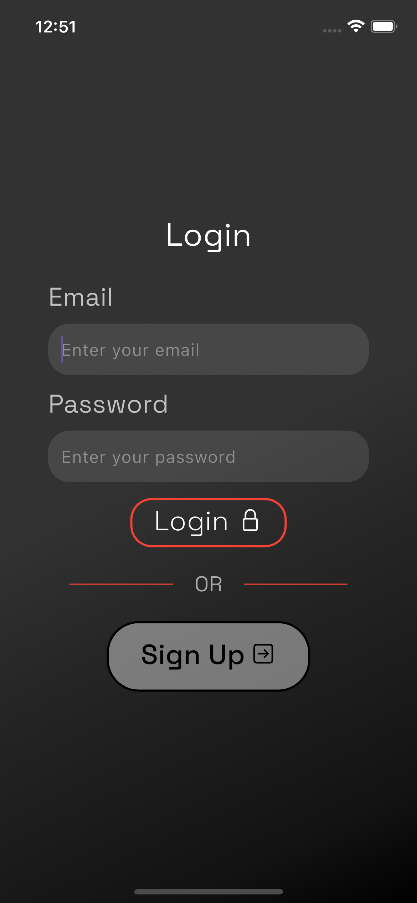
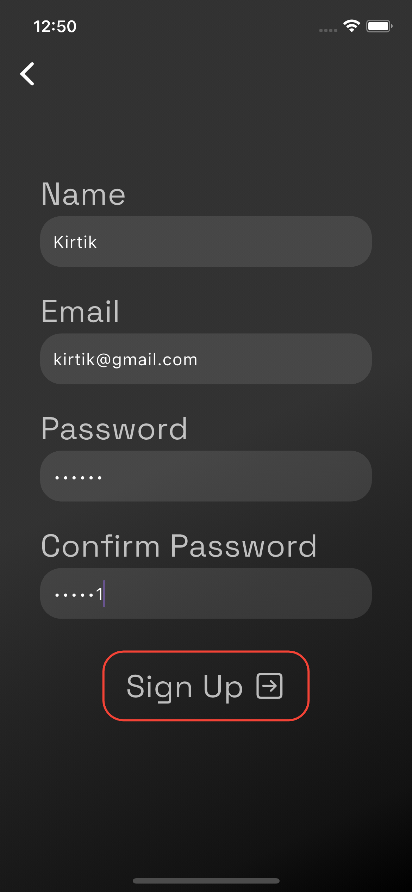
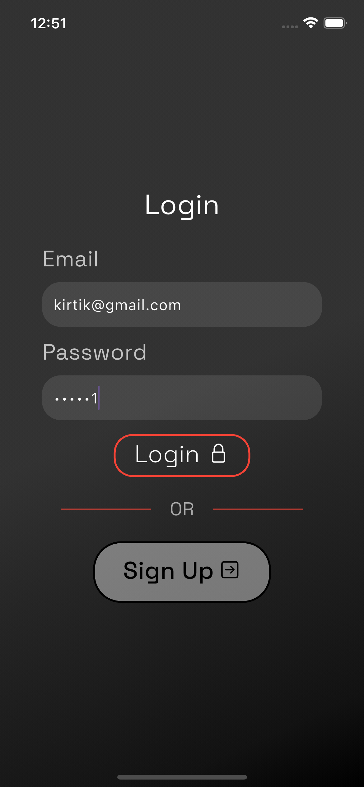
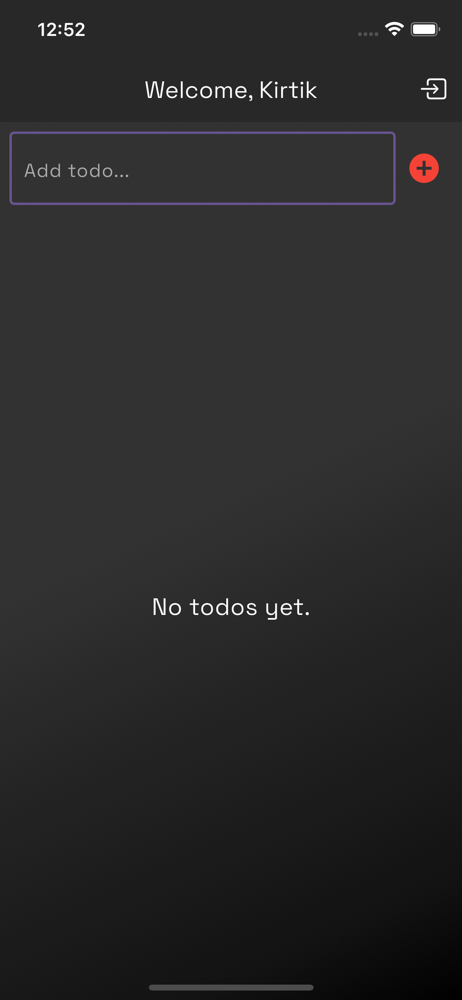
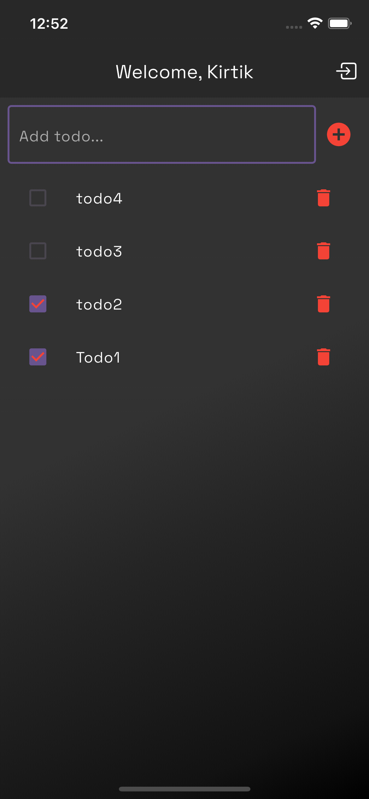

# Flutter Firebase Todo App

A sleek and minimal Todo app built using **Flutter** and **Firebase**, with authentication and real-time Firestore database integration. Each user's tasks are stored securely and privately.

## 🚀 Features

- 🔐 Firebase Authentication (Signup/Login)
- 📝 Create, read, update, and delete todos
- 🔄 Real-time sync using Cloud Firestore
- 🎨 Clean, dark-themed UI with linear gradient backgrounds
- 👤 User-specific data management (each user sees only their todos)
- ✅ Responsive design

## 📦 Tech Stack

- **Flutter** (UI + Logic)
- **Firebase Auth** (User authentication)
- **Cloud Firestore** (Real-time database)
- **Google Fonts** (Typography)

## 📸 Screenshots

<p align="center">
  
  
  
  
  
</p>


## 🛠 Setup Instructions

1. Clone the repo:
   ```bash
   git clone https://github.com/yourusername/flutter-firebase-todo.git
   cd flutter-firebase-todo
   ```
   
2. Install dependencies:
   ```bash
   flutter pub get
   ```
   
3. Set up Firebase:
	•	Create a Firebase project at Firebase Console
	•	Add iOS/Android app to the project
	•	Download and place google-services.json (Android) and GoogleService-      Info.plist (iOS) in the appropriate directories

4. Run the app:
   ```bash
   flutter run
   ```

✍️ Author
	•	Your Name – @yourhandle

 📜 License

This project is licensed under the MIT License. See the LICENSE file for details.
---

## 💼 LinkedIn Project Description

> **Flutter Firebase Todo App**  
> Built a full-featured Todo application using **Flutter** and **Firebase**, allowing users to securely sign up/login with Firebase Authentication and manage personal todo lists in real-time using Firestore. The app includes a modern dark-themed UI with linear gradients and user-specific data segregation.  
>  
> 🔧 Tools Used: Flutter · Dart · Firebase Auth · Cloud Firestore · Google Fonts  
> 🎯 Features: Authentication · Realtime CRUD · Gradient UI · User-specific data  
>  
> 📱 _Deployed and tested on both Android and iOS simulators._

---

Let me know if you'd like to include screenshots, badges, or add GitHub Actions for CI/CD!
